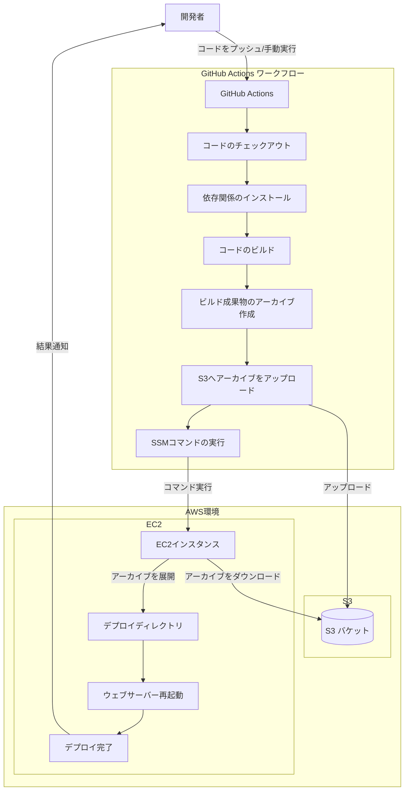
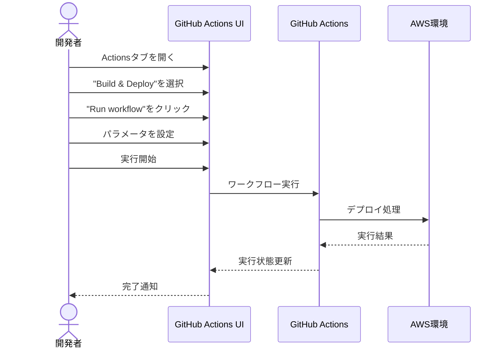

# GitHub Actions デプロイマニュアル

このドキュメントでは、BulkSender-Frontプロジェクトのデプロイフローおよび関連するGitHub Actionsワークフローの実行方法について詳しく説明します。

## 目次

- [デプロイフロー概要](#デプロイフロー概要)
- [デプロイの実行方法](#デプロイの実行方法)
- [デプロイのカスタマイズ](#デプロイのカスタマイズ)
- [デプロイ成功の確認方法](#デプロイ成功の確認方法)
- [トラブルシューティング](#トラブルシューティング)
- [緊急時の対応](#緊急時の対応)

## デプロイフロー概要

BulkSender-Frontプロジェクトのデプロイフローは以下のステップで構成されています：

1. **コードのビルド**: プロジェクトのソースコードをビルドして、最適化された静的ファイルを生成
2. **ビルド成果物のアーカイブ作成**: ビルドされたファイルを圧縮してデプロイ用のパッケージを作成
3. **S3へのアップロード**: 作成したアーカイブをS3バケット (`multisender-deploy`) にアップロード
4. **SSMコマンド実行**: AWS Systems Manager (SSM) を使用してEC2インスタンスにデプロイコマンドを送信
5. **デプロイ実行**: EC2インスタンス上でアーカイブを展開し、適切なディレクトリに配置
6. **アプリケーション再起動**: 必要に応じてウェブサーバーを再起動し、新しいバージョンを反映

このフローはすべて GitHub Actions によって自動化されています。S3はデプロイアーカイブの一時保存先として使用され、実際のデプロイはEC2インスタンス上で実行されます。

### デプロイフロー図



## デプロイの実行方法

### 手動デプロイの実行手順

1. GitHub リポジトリにアクセスします
2. 上部メニューから「Actions」タブをクリックします
3. 左サイドバーから「Build & Deploy」ワークフローを選択します
4. 右側の「Run workflow」ボタンをクリックします
5. 以下のパラメータを設定します：
   - **Use workflow from**: デプロイ元のブランチを選択（通常は `main` または `develop`）
   - **Select Environment**: デプロイ先の環境を選択（`production` または `staging`）
   - **Select App Path**: デプロイ先のパスを選択（必要に応じて）
6. 緑色の「Run workflow」ボタンをクリックして実行開始



### デプロイパラメータの詳細

| パラメータ | 説明 | 選択肢 |
|----------|------|-------|
| Use workflow from | デプロイするコードのソースブランチ | main, develop, feature/* など |
| Select Environment | デプロイ先の環境 | production, staging, demo |
| Select App Path | アプリケーションのデプロイパス | /var/www/vhost/...... |

## デプロイのカスタマイズ

### 環境変数の設定
### ビルドパラメータの変更

ビルドパラメータを変更する場合は、`.github/workflows/deploy.yml` ファイルを編集し、ビルドコマンドやその他のパラメータを調整してください。

```yaml
# ビルドコマンドの例
- name: Build application
  run: |
    npm ci
    npm run build -- --mode ${{ github.event.inputs.environment }}
```

## デプロイ成功の確認方法

1. GitHub Actionsのワークフロー実行ページで、すべてのステップが正常に完了したことを確認（緑色のチェックマーク）
2. デプロイされたURLにアクセスして、アプリケーションが正常に動作することを確認：
   - 本番環境: `http://multisender.easy-go.me/`
   - ステージング環境: `http://stg-multisender.easy-go.me/`

3. 以下の項目を重点的にチェック：
   - ウェブページが正常に表示されるか
   - 主要な機能（ウォレット接続、送金シミュレーションなど）が動作するか
   - レイアウトやスタイルが崩れていないか

## トラブルシューティング

### デプロイ中のエラー

#### IAM関連のエラー
```
Error: Access denied or invalid credentials when accessing AWS resources
```

**解決策**:
- GitHubの設定で「Secrets and variables」→「Actions」を開き、AWS関連のシークレットが正しく設定されているか確認
- IAMユーザーに適切な権限が付与されているか確認
- IAMポリシーがS3バケットとSSMコマンド実行に適切なアクセス権を持っているか確認

#### ビルドエラー
```
Error: Build failed with exit code 1
```

**解決策**:
- ワークフローログでビルド失敗の原因を特定
- 依存関係の問題があれば、`package.json`を確認し必要な依存関係を追加
- 型エラーや構文エラーがあれば修正してから再度デプロイを実行

#### S3アップロードエラー
```
Error: Failed to upload files to S3 bucket
```

**解決策**:
- S3バケット `multisender-deploy` が存在することを確認
- IAMユーザーがバケットへの書き込み権限を持っているか確認
- バケットポリシーの設定を確認

#### SSMコマンド実行エラー
```
Error: Failed to execute SSM command on instance
```

**解決策**:
- EC2インスタンスが実行中であることを確認
- インスタンスにSSMエージェントがインストールされているか確認
- インスタンスのセキュリティグループで必要なポートが開放されているか確認
- IAMユーザーがSSM:SendCommandなどの権限を持っていることを確認

### その他のトラブルシューティング

- デプロイ後にウェブサイトが更新されない場合は、ブラウザのキャッシュをクリアしてみてください
- EC2インスタンス上のログファイルを確認して詳細なエラー情報を取得してください
- Webhook通知が設定されている場合は、通知の内容を確認して詳細なエラー情報を入手してください

## 緊急時の対応

### デプロイ失敗時のロールバック手順

1. GitHubの「Actions」タブで過去の成功したデプロイを特定
2. 該当するコミットハッシュをメモ
3. 「Run workflow」から手動でデプロイを実行し、ソースブランチに代わりにコミットハッシュを指定


---

[戻る](../setup/)